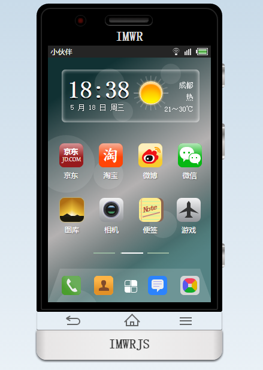
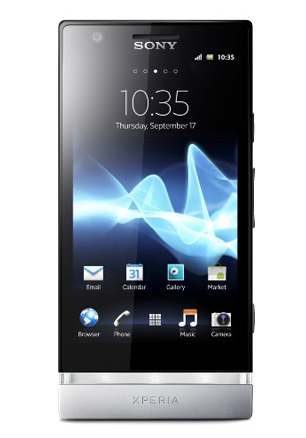

# WrMobile —— Imageless Mobile Devices
很久前业余写的 CSS+JS 模拟手机，主体样式按照当时用的 sony lt22i 手机外观编写，没有任何图片素材，且把自己开发的大部分 jQuery plugin 整合了进去。

###插件特性###
+ 长按开关机、短按解锁屏（右侧顶部按钮）—— See [MouseMe](https://github.com/imwr/MouseMe)
+ 开机粒子动画 —— See [SimpleParticle](https://github.com/imwr/SimpleParticle)
+ 开机文字 —— See [ColorChange](https://github.com/imwr/ColorChange)
+ 九宫格解锁（默认密码 1→5→3） —— See [NineBox](https://github.com/imwr/NineBox)
+ 通话、联系人、信息 Tab —— See [MovableTab](https://github.com/imwr/MovableTab)
+ 信息搜索—— See [AutoAddto](https://github.com/imwr/AutoAddto)
+ 拍照保存图片功能 —— See [SimpleCamera](https://github.com/imwr/SimpleCamera)
+ 相册图片Slider（完善中）
+ 相册图片工具（完善中）
+ 桌面图标拖拽（完善中）
+ 相册图片Slider（完善中）
+ 待续......

###其他特性###
+ 京东、微信、微博等纯CSS图标（与实际应用图标存在差异）
+ 动态气泡桌面
+ 超过20秒无任何操作，自动锁屏
+ 应用中快速回到桌面（点击Home键）
+ 仿iphone退出应用确认框（底部第一个按键）
+ 最近使用应用层，快捷进入历史应用（长按Home键）
+ 桌面图标拖拽

###snapshot###

###sony lt22i###

###demo###
See [here](https://github.com/imwr/MouseMe)